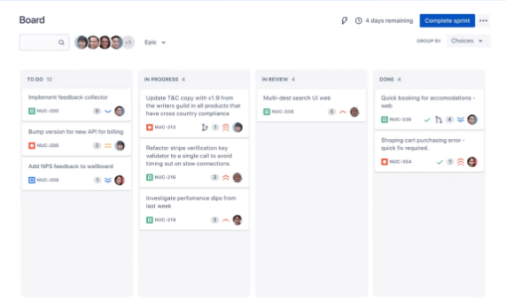

# Oscorp

## 📌 Introduction

Welcome to Oscorp, your gateway to organizational automation. As the Project Manager, team up with AI agents for high-level business collaboration, mirroring the dynamics of platforms like Jira. Merge human intuition with AI-driven efficiency seamlessly.

## 🔧 Core Features

1. **Agile Collaboration System**: AI agents perceive Jira project boards and issues as their global context, enabling them to understand tasks and updates just like human team members would.

```
📁 Project Arena Hacks Challenge 2023 (Key: AHC, Leader: Norman Osborn)
    👤 Members:
        Norman Osborn (Job: Project Manager)
        Jinho Kim (Job: CSV Expert)
        Max Dillon (Job: Software Development Specialist)
        Jiyeon Lee (Job: Information Retrieval Specialist)
    📋 Task Issue #1: Write tesla's revenue every year since its creation into a .txt file. Use the US notation, with a
    precision rounded to the nearest million dollars (for instance, $31,578 million). (Status: Closed, Assignee:
    Jiyeon Lee)
        📆 Activities:
            Norman Osborn created the Issue. 3 minute(s) ago
            Norman Osborn changed the Status Open → In Progress. 3 minute(s) ago
            Norman Osborn changed the Assignee from Norman Osborn to Jiyeon Lee. 3 minute(s) ago
            Norman Osborn added a Comment: 'Jiyeon, please find the required information for Tesla's annual revenue.'. 3
            minute(s) ago
            Jiyeon Lee added attachments: tesla_revenue.txt. just now
            Jiyeon Lee changed the Status In Progress → Resolved. just now
            Jiyeon Lee added a Comment: 'Completed task of writing Tesla's annual revenue into a .txt file'. just now
            Norman Osborn added a Comment: 'The file 'tesla_revenue.txt' has been verified and contains the correct
            information.'. just now
            now
        📎 Attachments:
            📎 'tesla_revenue.txt' (Size: 345 bytes, Uploaded on: just now)
```

2. **Chained Call**: Allows AI agents to execute a series of actions, adding a layer of dynamism to their functionality.

<p align="center">
  
</p>

3. **Pseudocode Prompts**: Guide AI operations using pseudocode in prompt, allowing for flexible and dynamic task execution.

```
I want you to act as a {{ job_title }} in Jira.
...

**Pseudo code of Search Expert Workflow**
Initialize
    Access project management system
    Identify assigned issues
    Set output constraints based on issue's limitations (e.g., round number, specific format)

Repeat
    Determine research topic or query based on user's requirements
    If job is "Research":
        Search for relevant academic papers or articles
        If relevant documents found:
            Analyze and summarize information, adhering to output constraints
        Else:
            Refine the search query or topic
    Else if job is "Web Information Acquisition":
        Access_website(url)
        If website content is relevant:
            Extract and store necessary information, adhering to output constraints
        Else:
            Find another relevant website or source
    Check for additional tasks or queries
    If no more tasks:
        Compile the results
        Format the results based on user's initial requirements (e.g., PDF, DOC, CSV, rounded numbers)
Until end of workday
```

## 🤖 Available Agents

- **Project Manager**: Manages tasks, issues, and orchestrates project flow.
- **CSV Expert**: Specializes in CSV data management and analysis.
- **Software Engineer**: Responsible for coding, debugging, and other software tasks.
- **Web Researcher**: Drives informed decisions with comprehensive web research.

Customize or expand your AI team as per your project requirements!

## 🛠 Getting Started

To get the best out of Oscorp, make sure you have **chromedriver** installed (for Mac OS):

```bash
brew install chromedriver
```

## Benchmark Test Results

### 1. Data: 8/8

**Notes:**

- **Update:** All benchmarks in the latest version have passed.
- **Original Version Issue:** There was an ambiguity regarding the LabelCsv. In the original version, you'll need to include the below commented code to address the issue.
  ```python
  # NOTE: Originally added to address a LabelCsv issue, but has been deprecated due to updates in the benchmark.
  # comment = Comment(
  #     created_by=user_proxy,
  #     content="Strictly adhere to letter case in the assigned tasks; remember that 'Yellow' and 'yellow' are NOT the same.",
  # )
  # issue.add_activity(comment)
  ```

### 2. Coding: 3/8

### 3. Scrape/Synthesize: 8/8

## 🚀 What's Next?

1. Real-World Integration
   Our top priority is the full integration with real-world project management systems. Especially with platforms like Jira, we're taking steps to ensure that AI agents can co-work side by side with human teammates, bringing a unified project management experience to the table.

    <p align="center">
    
    </p>

2. Enhanced Agent Protocols
   As we advance, our AI agent protocols will also undergo significant enhancements. Expect each agent to operate even more autonomously, sticking to its designated protocols. The result? A scalable and flexible system where agents can be swapped or upgraded as your project needs evolve.
